# 🏨 Hotel Management System

A modern and responsive **Hotel Management System** built with **Laravel**. The system provides a complete hotel management and online booking solution with separate interfaces for **customers** and **administrators**.

Customers can browse rooms, check availability, customize bookings, apply coupons, complete the booking process, and manage their bookings. Administrators can manage rooms, room types, rates, bookings, customers, facilities, coupons, and hotel settings from the admin panel.

---

## ✨ Features

### 👤 Customer Features

* 🛏️ Browse available room types
* 🔍 View room details
* 📅 Select check-in and check-out dates
* 👥 Select number of guests
* ✅ Check room availability
* 🧾 Customize booking
* 🎟️ Apply coupon codes
* 💰 Automatic booking rate calculation
* 👤 Customer registration
* 🔐 Authentication before booking confirmation
* 💳 Payment workflow
* ✅ Payment success/failed handling
* 📋 View booking history
* 🔎 View individual booking details
* 📱 Fully responsive customer interface

---

### 🔐 Admin Features

#### 📊 Dashboard

* Admin dashboard
* Hotel management overview

#### 🛏️ Room Type Management

* Create room types
* Edit room types
* Delete room types
* Activate/deactivate room types
* Manage room type information

#### 🚪 Room Management

* Add rooms
* Edit rooms
* Delete rooms
* Update room status
* Manage individual rooms

#### 💰 Room Rate Management

* Create room rates
* Edit room rates
* Delete room rates
* Activate/deactivate room rates
* Manage room pricing

#### 📅 Booking Management

* View bookings
* Create bookings
* Edit bookings
* Update booking status
* Delete bookings
* Check room availability
* Calculate booking rates
* Search customers
* Apply coupons

#### 🎟️ Coupon Management

* Create coupons
* Edit coupons
* Delete coupons
* Activate/deactivate coupons

#### 🏊 Facility Management

* Add hotel facilities
* Edit facilities
* Delete facilities
* Activate/deactivate facilities

#### 👥 Customer Management

* View customers
* View customer details
* Activate/deactivate customers

#### ⚙️ Settings

* Manage hotel/application settings

---

# 🔄 Booking Flow

```text
Browse Rooms
     ↓
Select Room Type
     ↓
Select Dates & Guests
     ↓
Check Availability
     ↓
Customize Booking
     ↓
Apply Coupon (Optional)
     ↓
Review Booking
     ↓
Login / Register
     ↓
Confirm Booking
     ↓
Payment
     ↓
Payment Success / Failed
     ↓
Booking History
```

---

# 👥 User Roles

## Customer

Customers can:

* Browse rooms without logging in
* View room details
* Start a booking
* Customize their booking
* Apply coupons
* Register/login
* Confirm bookings
* Complete payments
* View booking history

## Administrator

Administrators can manage:

* Room types
* Rooms
* Room rates
* Bookings
* Coupons
* Facilities
* Customers
* Hotel settings

Admin routes are protected with:

```text
auth + admin
```

Customer dashboard routes are protected with:

```text
auth + customer
```

---

# 🛠️ Technology Stack

| Technology             | Usage                    |
| ---------------------- | ------------------------ |
| PHP                    | Backend programming      |
| Laravel                | Backend framework        |
| MySQL                  | Database                 |
| Blade                  | Server-side templating   |
| HTML5                  | Frontend structure       |
| CSS3                   | Styling                  |
| JavaScript             | Frontend interactions    |
| Laravel Authentication | User authentication      |
| MVC Architecture       | Application architecture |
| Git / GitHub           | Version control          |

---

# 📁 Project Structure

```text
hotel-management-system/
│
├── app/
│   ├── Http/
│   │   └── Controllers/
│   │       ├── Admin/
│   │       └── Customer/
│   │
│   └── Models/
│
├── database/
│   ├── migrations/
│   └── seeders/
│
├── public/
│
├── resources/
│   └── views/
│       ├── admin/
│       └── customer/
│
├── routes/
│   ├── admin.php
│   └── customer.php
│
├── screenshots/
│   ├── frontend/
│   │   ├── ss1.jpg
│   │   ├── ss2.jpg
│   │   └── ...
│   │
│   ├── backend/
│   │   ├── ss1.jpg
│   │   ├── ss2.jpg
│   │   └── ...
│   │
│   └── mobile_view/
│       ├── ss1.jpg
│       ├── ss2.jpg
│       └── ...
│
├── .env.example
├── composer.json
├── package.json
└── README.md
```

---

# 📸 Screenshots

## 🌐 Frontend

<table>
  <tr>
    <td align="center">
      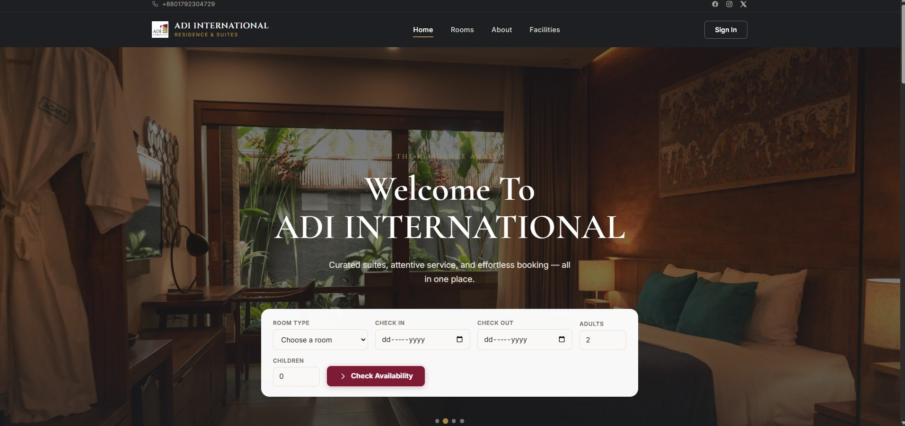
    </td>
    <td align="center">
      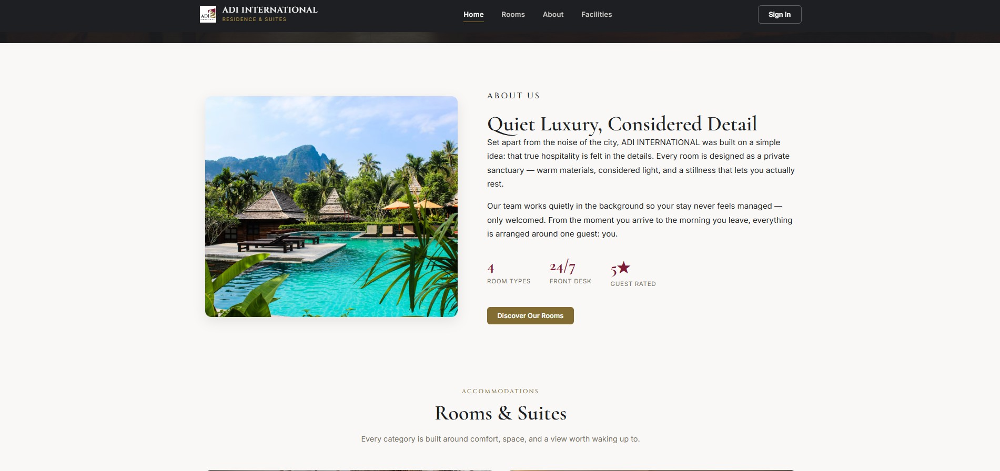
    </td>
  </tr>
  <tr>
    <td align="center">
      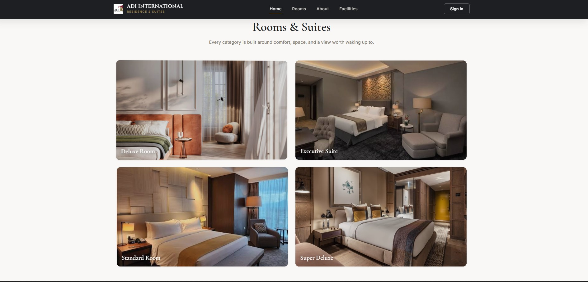
    </td>
    <td align="center">
      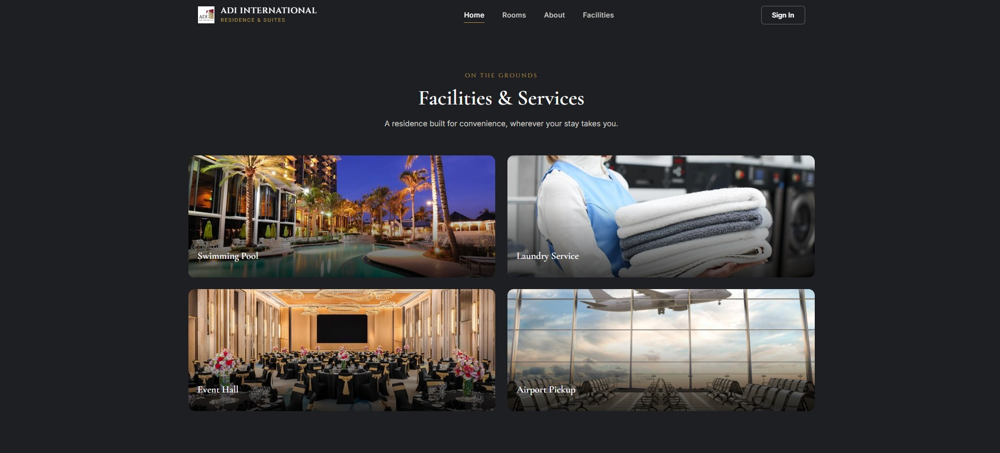
    </td>
  </tr>
  <tr>
    <td align="center">
      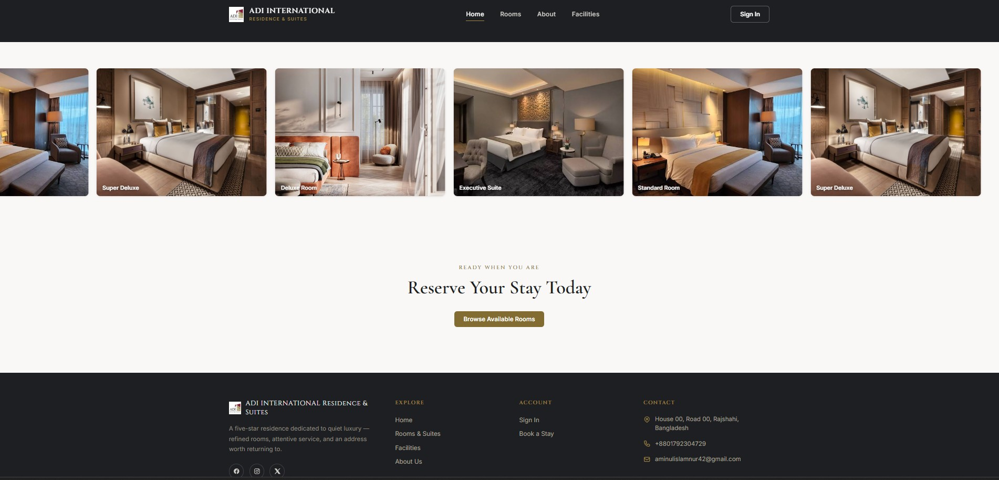
    </td>
    <td align="center">
      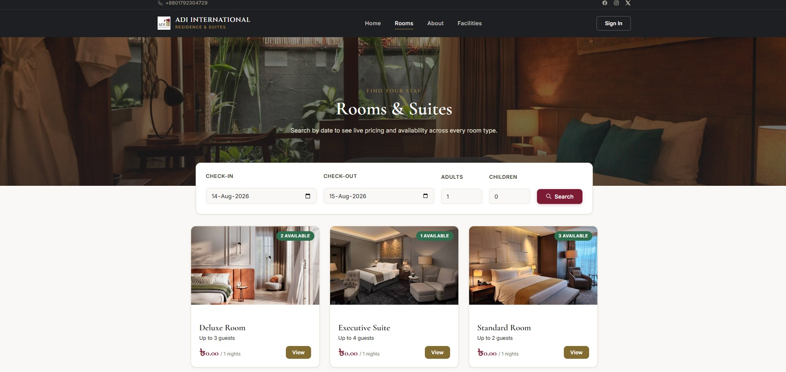
    </td>
  </tr>
  <tr>
    <td align="center">
      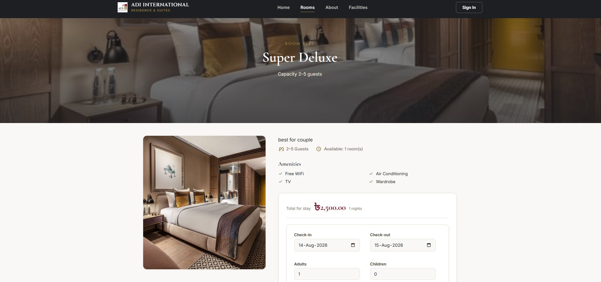
    </td>
    <td align="center">
      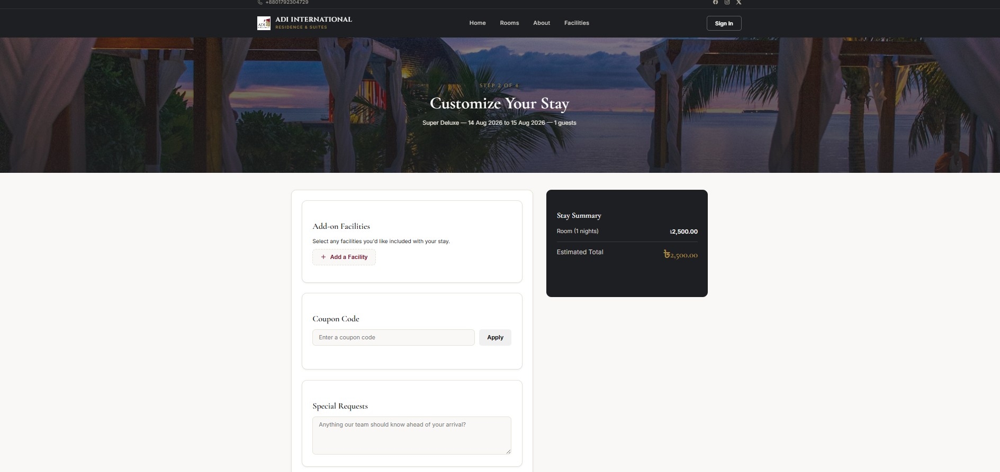
    </td>
  </tr>
  <tr>
    <td align="center">
      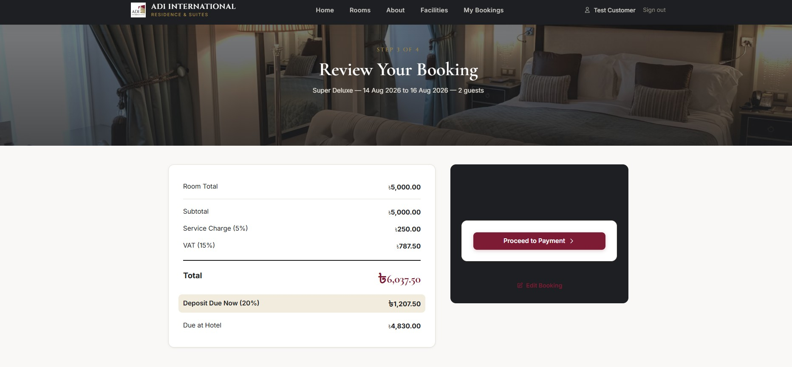
    </td>
    <td align="center">
      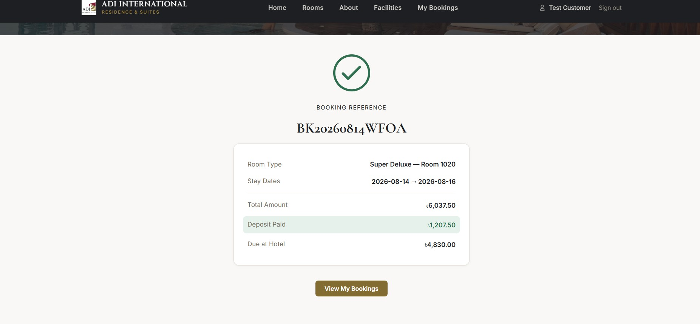
    </td>
  </tr>
</table>

---

## 🔐 Backend / Admin Panel

<table>
  <tr>
    <td align="center">
      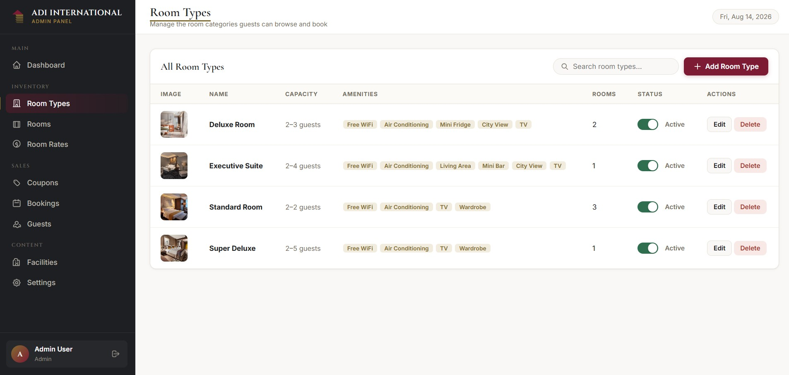
    </td>
    <td align="center">
      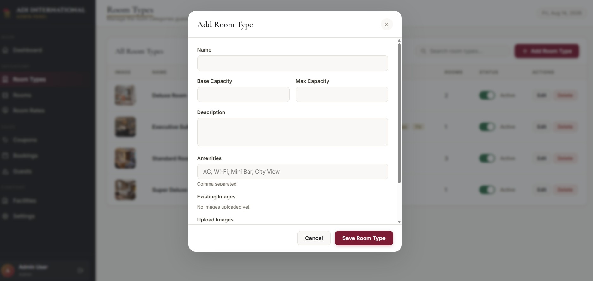
    </td>
  </tr>
  <tr>
    <td align="center">
      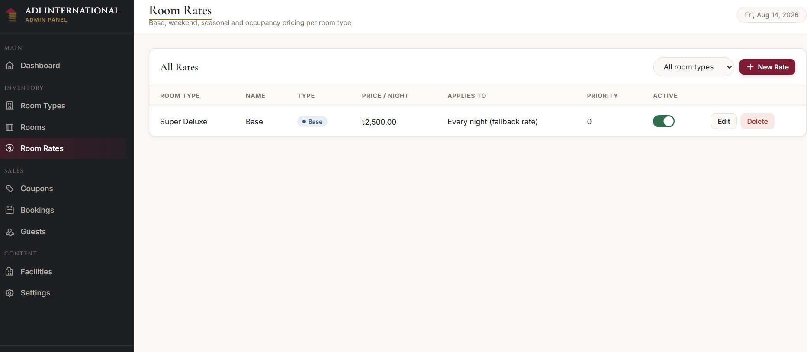
    </td>
    <td align="center">
      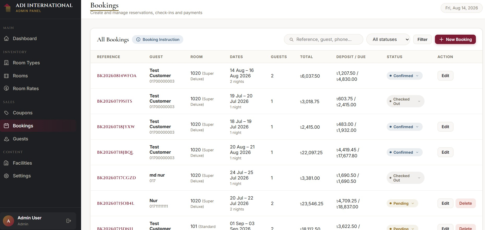
    </td>
  </tr>
  <tr>
    <td align="center">
      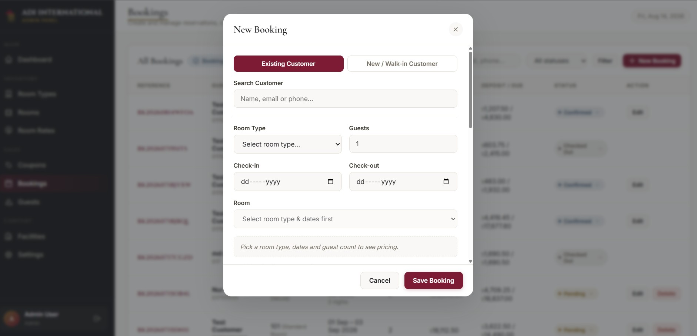
    </td>
    <td align="center">
      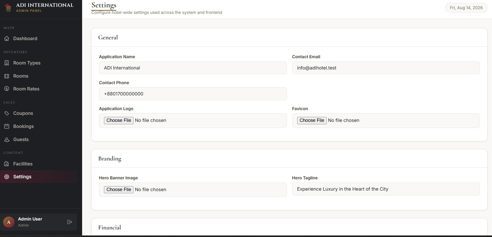
    </td>
  </tr>
</table>

---

## 📱 Mobile View

<table>
  <tr>
    <td align="center">
      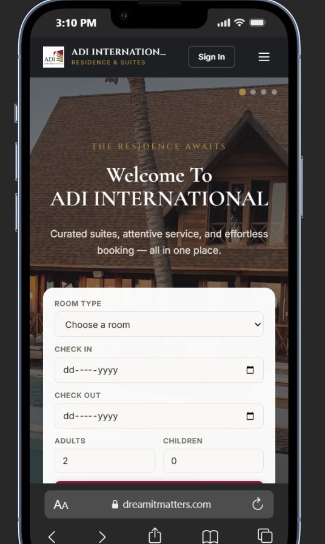
    </td>
    <td align="center">
      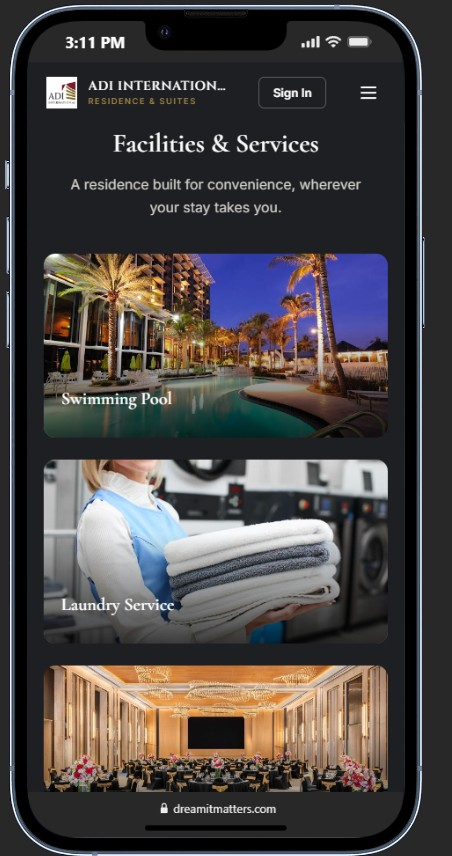
    </td>
  </tr>
  <tr>
    <td align="center">
      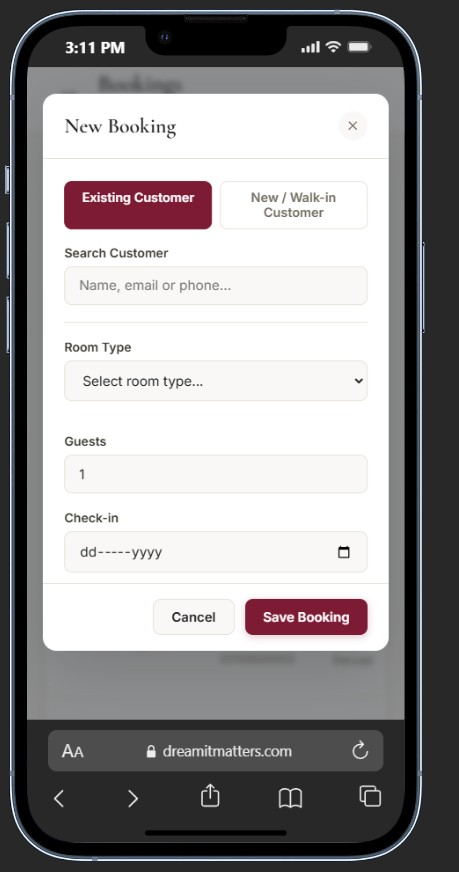
    </td>
    <td align="center">
      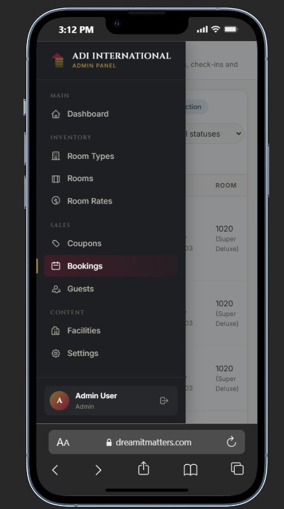
    </td>
  </tr>
</table>

---

# 🚀 Installation & Setup

## 1. Clone the Repository

```bash
git clone https://github.com/your-username/hotel-management-system.git
```

## 2. Navigate to the Project

```bash
cd hotel-management-system
```

## 3. Install PHP Dependencies

```bash
composer install
```

## 4. Install Frontend Dependencies

```bash
npm install
```

## 5. Create Environment File

### Linux / macOS

```bash
cp .env.example .env
```

### Windows

```bash
copy .env.example .env
```

## 6. Generate Application Key

```bash
php artisan key:generate
```

## 7. Configure Database

Create a MySQL database and configure the `.env` file:

```env
DB_DATABASE=hotel_management
DB_USERNAME=root
DB_PASSWORD=
```

Update the database credentials according to your environment.

## 8. Run Migrations

```bash
php artisan migrate
```

If seeders are available:

```bash
php artisan db:seed
```

Or:

```bash
php artisan migrate --seed
```

## 9. Create Storage Link

```bash
php artisan storage:link
```

## 10. Build Frontend Assets

```bash
npm run build
```

For development:

```bash
npm run dev
```

## 11. Start Laravel Server

```bash
php artisan serve
```

Open:

```text
http://127.0.0.1:8000
```

---


# 🔒 Authentication & Authorization

The system uses Laravel middleware to control access based on user roles.

### Admin Middleware

```text
auth
admin
```

Only authenticated administrators can access the admin panel.

### Customer Middleware

```text
auth
customer
```

Only authenticated customers can access their booking dashboard.

Guests can browse rooms and start the booking process without authentication. Authentication is required before reviewing and confirming a booking.

---

# 💳 Payment System

The project currently contains a **fake/test payment workflow** for development and demonstration purposes.

```text
Booking
   ↓
Checkout
   ↓
Fake Payment Gateway
   ↓
Callback
   ↓
Payment Success / Failed
```

The payment architecture can be extended to support a real payment gateway.

---

# 🧩 Core Modules

```text
┌──────────────────────────────────────┐
│       HOTEL MANAGEMENT SYSTEM        │
├──────────────────────────────────────┤
│                                      │
│  Customer Side                       │
│  ├── Room Browsing                   │
│  ├── Availability                    │
│  ├── Booking                         │
│  ├── Customization                   │
│  ├── Coupons                         │
│  ├── Payment                         │
│  └── Booking History                 │
│                                      │
│  Admin Side                          │
│  ├── Dashboard                       │
│  ├── Room Types                      │
│  ├── Rooms                            │
│  ├── Room Rates                      │
│  ├── Bookings                        │
│  ├── Coupons                         │
│  ├── Facilities                      │
│  ├── Customers                       │
│  └── Settings                        │
│                                      │
└──────────────────────────────────────┘
```

---

# 🚧 Future Improvements

Potential future improvements include:

* 💳 Real payment gateway integration
* 📧 Email booking confirmation
* 📱 SMS notifications
* 🧾 Automatic invoice generation
* 📊 Advanced hotel reports
* 📈 Revenue analytics
* 🏢 Multiple hotel/branch support
* 🛎️ Online check-in/check-out
* 👥 Additional staff roles
* 📅 Advanced booking calendar
* ⚡ Real-time room availability
* 🔌 REST API for mobile applications

---

# 📄 License

This project is developed for **educational, portfolio, and demonstration purposes**.

---

# 👨‍💻 Developer

**MD Aminul Islam Nur**

**Laravel / PHP Developer**

📍 Rajshahi, Bangladesh
